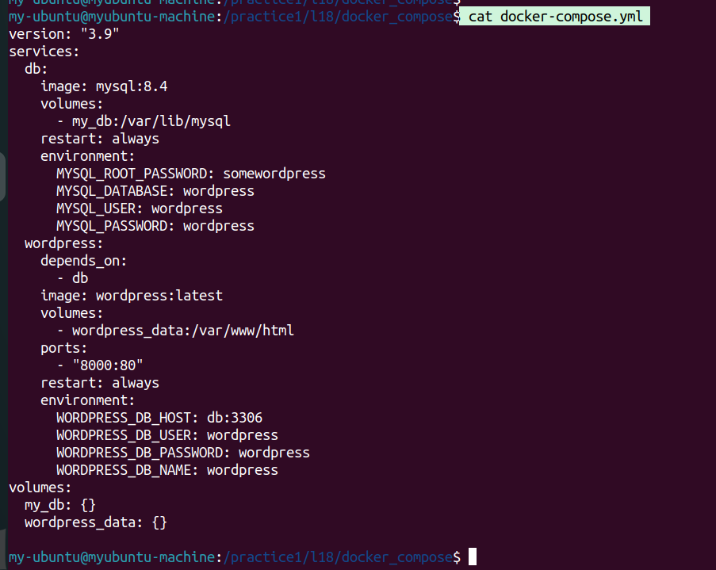
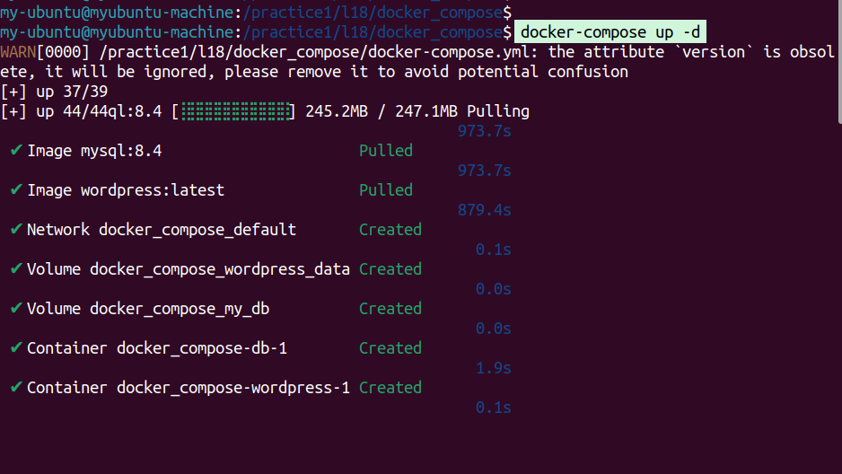
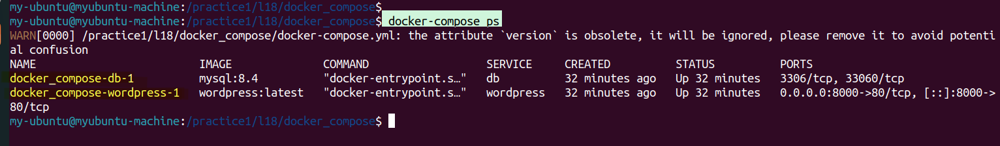
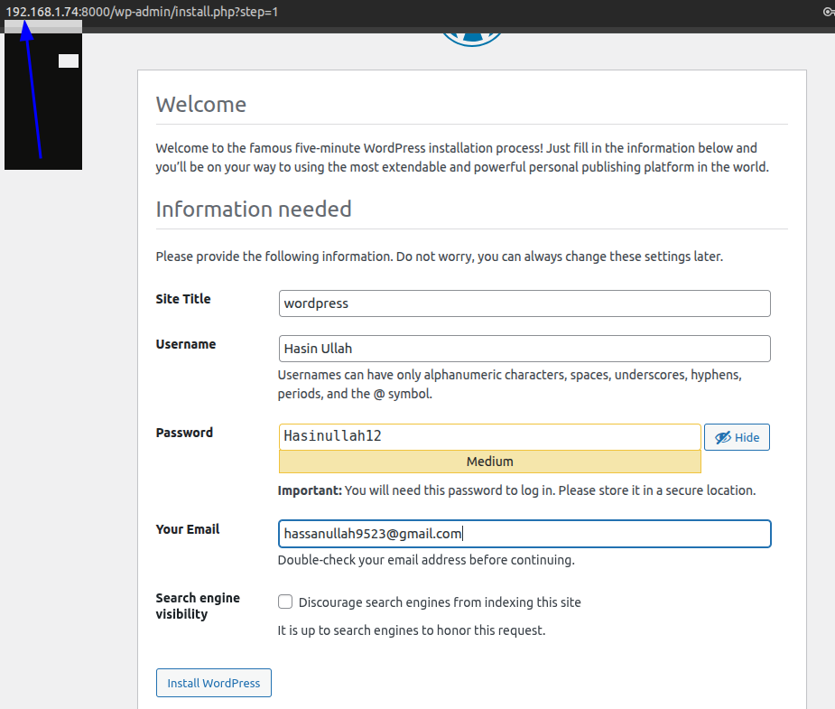
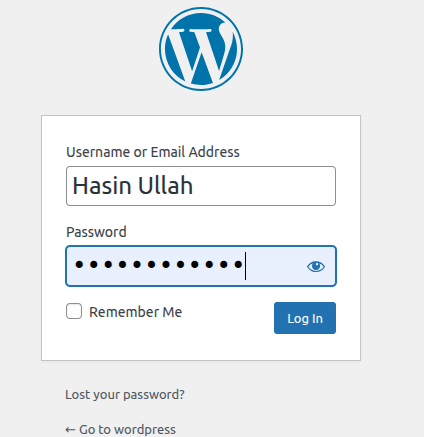
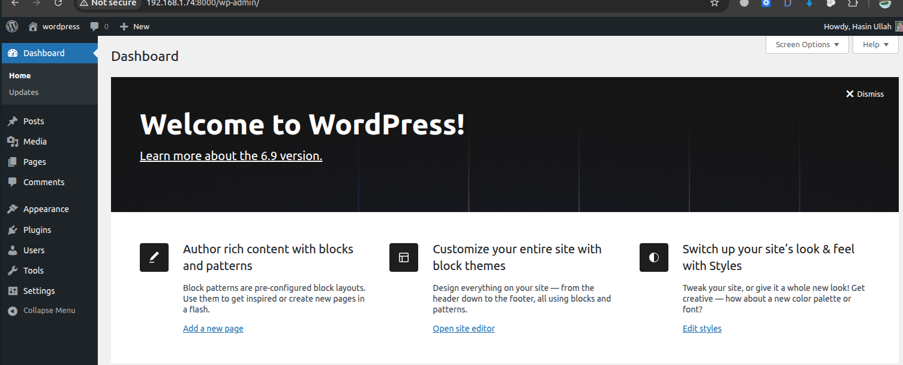
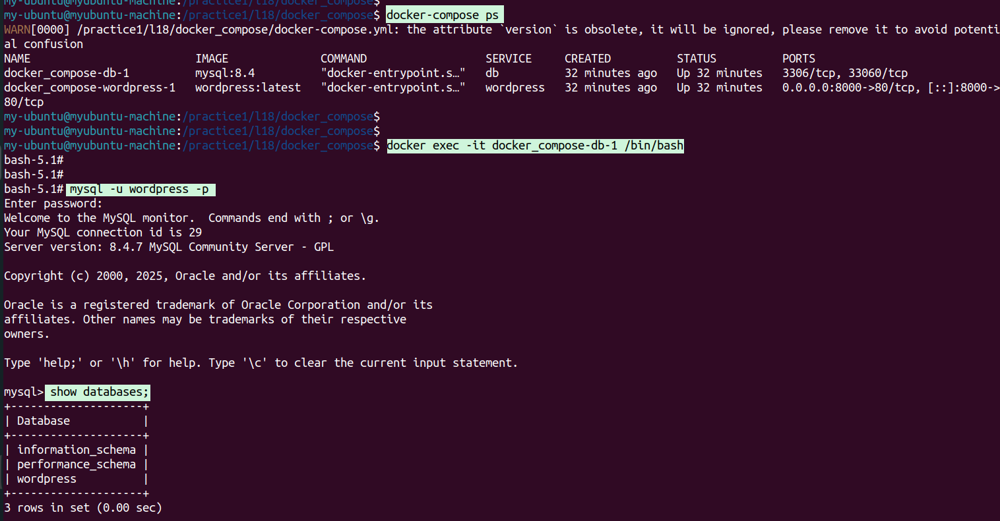
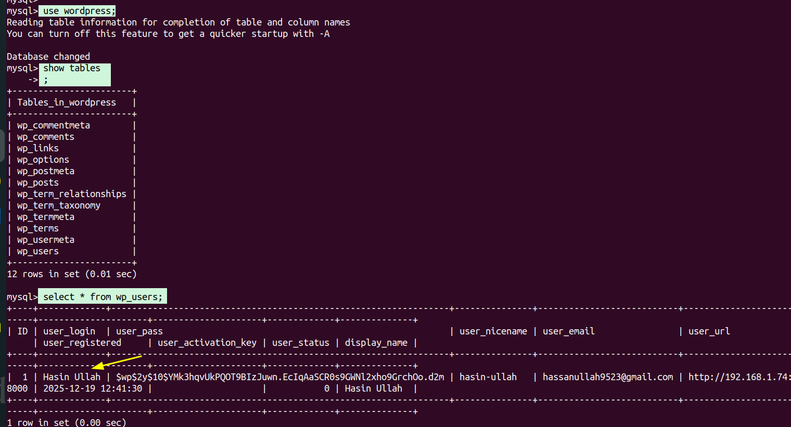

## Docker WordPress + MySQL Project

This project uses Docker Compose to deploy WordPress with a MySQL database
in a multi-container environment.

WordPress and MySQL run as separate services and communicate using
environment variables and Docker networking. Docker volumes are used
to persist data.

After deploying the setup, I logged into the WordPress dashboard,
created a new user, and then accessed the MySQL container to verify
that the WordPress user data was stored in the MySQL database tables.
This confirms successful integration between WordPress and MySQL.

## Docker-compose.yml file 
In this docker-compose.yml file, we created a multi-container setup for WordPress and MySQL.The MySQL service is used as the database and data is stored using Docker volumes.The WordPress service depends on the database, exposes port 8000, and connects to MySQL using environment variables.Docker volumes are used to persist data even if containers are restarted or removed.
cat Docker-compose.yml 

##   How to run 
##docker-compose up 

This project demonstrates how to run WordPress with a MySQL database using Docker Compose. It includes multi-container setup, volumes for data persistence, and environment variables for service communication.

#docker-compose ps
docker-compose ps shows the list of all containers created by your Docker Compose file, their current status (running or stopped), and which ports they are using.

## WordPress User-daashboard 

Access WordPress from your browser using the IP and port you assigned (e.g., http://localhost:8000).  
Login to WordPress and start managing your site; all data is stored in the MySQL container.

# wordpress Login 
#Enter your username and password 

# Welcome to word press 

## This screenshot shows how to log in to a MySQL database and how to access the container

docker exec -it <container_id>  /bin/bash
Mysql login 
mysql -u wordpress -p 

---------------------

#  Inside Mysql Commands 

use wordpress;
show tables
select * from wp_users;

use wordpress;       → Selects the WordPress database to work with.

show tables;         → Lists all tables inside the selected database.

select * from wp_users;  → Retrieves all records from the wp_users table (WordPress users).

